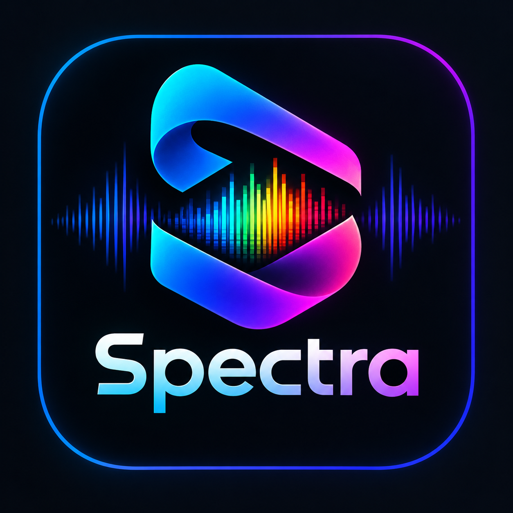
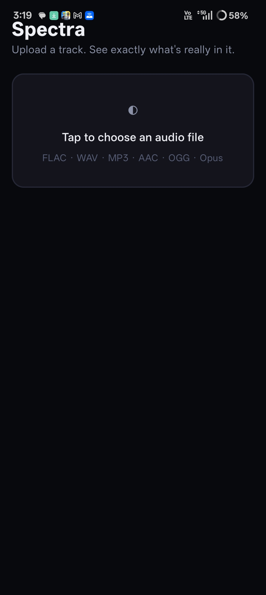
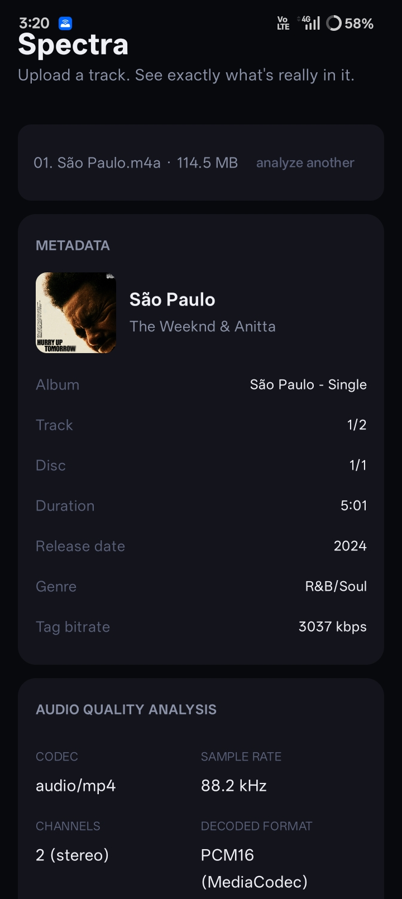
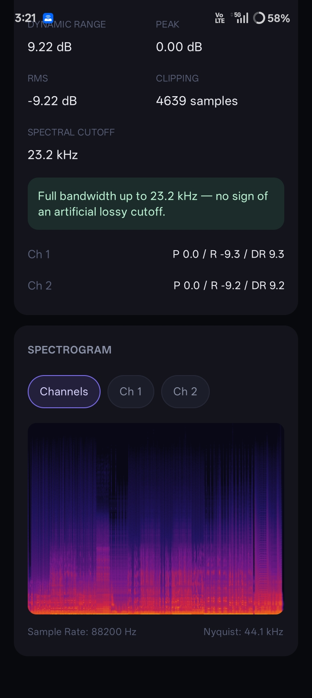

<div align="center">
  

  <h1>Spectra</h1>

  <p><strong>Upload a track. See exactly what's really in it.</strong></p>

  <p>
    <a href="https://github.com/aravindrejidev/Spectra/actions/workflows/build.yml">
      
    </a>
    
    
    <a href="https://github.com/aravindrejidev/Spectra/releases/latest">
      
    </a>
  </p>
</div>

---

## About

**Spectra** is a native Android app that takes any audio file and gives you a full
technical breakdown — a spectrogram, peak/RMS/dynamic range, clipping detection,
and a spectral-cutoff heuristic that flags **"fake lossless"** files: tracks tagged
as FLAC that were actually upscaled from a lossy source.

Everything runs **on-device**. The app doesn't request network access — no file is
ever uploaded anywhere.

---

## 📸 Showcase

<div align="center">
  <table>
    <tr>
      <td width="33%" align="center">
        <br />
        <sub><b>Upload a track</b></sub>
      </td>
      <td width="33%" align="center">
        <br />
        <sub><b>Metadata & quality report</b></sub>
      </td>
      <td width="33%" align="center">
        <br />
        <sub><b>Spectrogram</b></sub>
      </td>
    </tr>
  </table>
</div>

---

## ✨ Features

- 📊 **Spectrogram** — linear frequency axis, with a channel toggle (combined / Ch 1 / Ch 2)
- 🎚️ **Level analysis** — peak, RMS, dynamic range, clipping detection, per-channel breakdown
- 🕵️ **Spectral cutoff detection** — flags likely lossy-to-lossless transcodes by finding
  where a track's frequency content is artificially cut off, compared against known
  lossy-encoder signatures
- 🏷️ **Full metadata** — title, artist, album, genre, release date, track/disc numbers,
  embedded cover art
- 📁 **Broad format support** — FLAC, WAV, MP3, AAC, Vorbis, Opus (ALAC planned — see
  [Roadmap](#️-roadmap))
- 🔒 **Private by design** — no internet permission, nothing ever leaves your phone

---

## 🧰 Tech Stack

- **Kotlin** + **Jetpack Compose** for the UI
- **`MediaExtractor` / `MediaCodec`** (Android's own APIs) for decoding — no NDK/native
  dependency in this phase
- A hand-written **FFT / STFT DSP core**, streaming rather than buffering a whole track's
  analysis in memory, so peak memory stays roughly constant regardless of track length
- **`MediaMetadataRetriever`** for tags and embedded artwork

---

## 🏛️ Architecture

A small, single-module app organized by responsibility:

```
┌───────────────────────────────────────────────────────┐
│                 ui/  (Jetpack Compose)                 │
│    Screens, cards, spectrogram rendering, ViewModel    │
└───────────────────────────┬─────────────────────────────┘
                            │
       ┌────────────────────┼────────────────────┐
       ▼                    ▼                    ▼
┌───────────────┐  ┌───────────────────┐  ┌──────────────┐
│    decode/     │  │     metadata/      │  │     dsp/     │
│ MediaExtractor │  │ MediaMetadataRetr. │  │  FFT / STFT  │
│  + MediaCodec  │  │  tags + artwork    │  │ level stats  │
│  -> Float PCM  │  │                    │  │ cutoff calc  │
└───────────────┘  └───────────────────┘  └──────────────┘
```

`dsp/SpectrogramAnalyzer.kt` has no Android dependencies — it's plain Kotlin,
unit-testable on a normal JVM.

---

## 🚀 Getting Started

<div align="center">
  <a href="https://github.com/aravindrejidev/Spectra/releases/latest">
    
  </a>
</div>

Or grab the latest automatic build from the
[Actions tab](https://github.com/aravindrejidev/Spectra/actions/workflows/build.yml) —
every push builds a debug APK and uploads it as a workflow artifact.

### Build from source
```bash
git clone https://github.com/aravindrejidev/Spectra.git
cd Spectra
gradle assembleDebug
```
No Android Studio required — this project is built and iterated on entirely through
GitHub Actions from a phone.

---

## 🗺️ Roadmap

- [ ] **ALAC support** via [`org.jellyfin.media3:media3-ffmpeg-decoder`](https://github.com/jellyfin/media3-ffmpeg-decoder)
      (a prebuilt AAR, no NDK build step needed)
- [ ] **LUFS (integrated loudness) + True Peak**, via the same dependency's `ebur128` filter
- [ ] Extended tags (ISRC, composer, freeform comments) via a dedicated tag-parsing library
- [ ] Fully streaming decode for arbitrarily long files (currently capped at 20 minutes
      to stay within a phone's memory budget)

See **[CHANGELOG.md](CHANGELOG.md)** for what's already shipped and fixed.

---

## 💡 Contributing

This is currently a solo project, so there's no formal contributing process yet —
issues and pull requests are still welcome.

---

## ⚖️ License

Spectra is free software licensed under the **MIT License** — see
**[LICENSE](LICENSE)**.

---

<p align="center">
  Built to answer one question honestly: is this file really what it claims to be? 🎧
</p>
